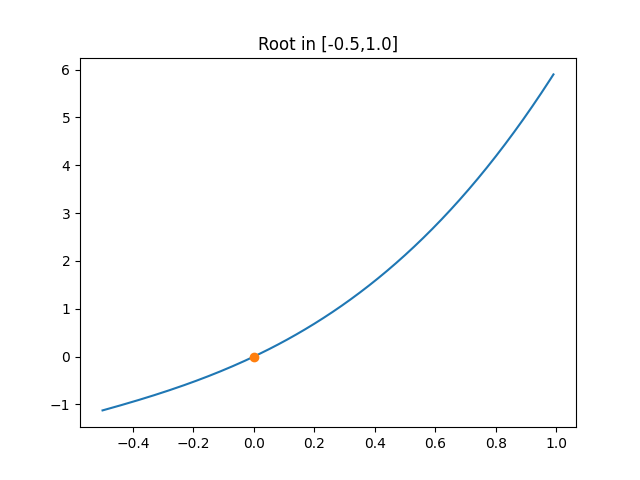

## <center> Национальный исследовательский университет информационных технологий, механики и оптики </center> 
### <center> Факультет Программной Инженерии и Компьютерной Техники </center> 
----
 <br /> 
 <br />
 <br />

## <center> Лабораторная работа 2. «Численное решение нелинейных уравнений и систем» </center>

### <center>Вариант № 21</center>

### <center>«Вычислительная математика»</center>


Работу выполнила:

Студентка группы P3212

Сенина Мария Михайловна

Преподаватель:

Малышева Татьяна Алексеевна 


<center>Санкт-Петербург</center>
<center>2022</center>

<div style="page-break-after: always; visibility: hidden">pagebreak</div>

## Цель работы
Поиск корней нелинеых уравнений и систем нелинейных уравнений. 
## Порядок выполнения работы
1. № варианта определяется как номер в списке группы согласно ИСУ.
2. Отделить корни заданного нелинейного уравнения графически (см. табл. 5)
3. Определить интервалы изоляции корней.
4. Вычислительная реализация задачи (в отчет):
   Уточнить корни  нелинейного уравнения (см. табл.5) с  точностью ε=10-2.
   
   **Вариант 21** Для уравнения $1,62x^3-8,15x^2+4,39x + 4,29 = 0$ найти корни методами: половинного деления, хорд, простой итерации.

   - Вычисления оформить в виде таблиц (1-4), удержать 3 знака после запятой.
   - Представить в отчете заполненные таблицы (1-4). В таблице 6 указаны методы для каждого из 3-х корней многочлена.
   -  Для  метода половинного деления  или метода хорд заполнить таблицу 1.
   - Для  метода Ньютона или метода секущих заполнить таблицу 2.
   -  Для  метода секущих заполнить таблицу 3.
   - Для  метода простой итерации заполнить таблицу 4.

    
    **Для нелинейных уравнений:**
   - Все численные методы (см. табл. 6) должны быть реализованы в  виде отдельных подпрограмм или классов.
   - Пользователь выбирает уравнение, корень/корни  которого требуется вычислить (3-5 функций, в том числе и трансцендентные), из тех, которые предлагает программа.
   - Предусмотреть ввод исходных данных (границы интервала/начальное приближение к корню и погрешность вычисления) из файла или с клавиатуры по выбору конечного пользователя. 
   - Выполнить верификацию исходных данных. Для метода половинного деления (метода хорд) анализировать наличие корня на введенном интервале. Для метода Ньютона (метода секущих) – выбор начального приближения (а или b).  Для метода простой итерации – достаточное условие сходимости метода. Программа должна реагировать на некорректные введенные данные.  
   - Предусмотреть вывод результатов (найденный корень уравнения, значение функции в корне, число итераций) в файл или  на экран по выбору конечного пользователя.
   - Организовать вывод графика функции, график должен полностью отображать весь исследуемый интервал (с запасом).
  
    **Для систем нелинейных уравнений:**
   - Рассмотреть систему двух уравнений.
   - Организовать вывод графика функций.
   - Для метода простой итерации проверить достаточное условие сходимости.
   - Вывод вектора неизвестных: $x_1,  x_2$
   - Вывод количества итераций, за которое было найдено решение.
   - Вывод вектора  погрешностей: $|x_i^k-x_i^{k-1}|$

1. Оформить отчет, который должен содержать:
   - Титульный лист.
   - Цель лабораторной работы.
   - Порядок выполнения работы.
   - Рабочие формулы используемых методов.
   - Заполненные таблицы (в зависимости от варианта: табл. 1 –  табл. 4).
   - Листинг программы.
   - Результаты выполнения программы.
   - Выводы

## Описание метода, расчетные формулы
### **Программная часть**

### Метод Ньютона 

**Идея метода:** функция $y=f(x)$ на отрезке $[a, b]$ заменяется касательной и в качестве приближенного значения корня $x^*=xn$ принимается точка пересечения касательной с осью абсцисс. 

Перед началом поиска корней надо проверить, что метод вообще можно применять, т.е. проверить достаточное условие сходимости:
- функция $y=f(x)$ определена и непрерывна на отрезке $[a; b]$;
- $f(a)·f(b) < 0$ (на концах отрезка $[a;b]$ функция имеет разные знаки);
- производные $f'(x)$ и $f''(x)$ сохраняют знак на отрезке $[a;b]$;
- производная $f'(x)≠0$

В качестве начального приближения в данном методе разумно выбрать $x_0 ∈ [a;b]$ так, чтобы выполнялось условие $f(x_0)·f''(x_0)> 0$ т.е. по сути нужно взять тот конец интервала $[a;b]$, для которого первая и вторая производная одного знака.  

**Сам метод:**

$x_1 = x_0 − \frac{f(x_0)}{tan(\alpha)} =  x_0 - \frac{f(x_0)}{f′(x_0)}$

$x_1 = x_0 − \frac{f(x_0)}{f′(x_0)}$

**Рабочая формула метода:** 
$x_i = x_{i−1} − \frac{f(x_{i−1})}{f'(x_{i−1})}$

Критерий окончания итерационного процесса:
$|x_n − x_{n−1}| ≤ ε$ или $|\frac{f(x_n)}{f′(x_n)} | ≤ ε$ или $|f(x_n) | ≤ ε$

Приближенное значение корня: $x^∗ = x_n$

###  Метод секущих
**Идея мемтода** - упростим метод Ньютона заменив сложно вычисляемые производные разностным приближением:

$f′(xi) ≈ \frac{f(x_i) − f(x_{i−1})}{x_i − x_{i−1}}$

**Рабочая формула метода:**

$x_{i+1} = x_i − \frac{x_i − x_{i−1}}{f(x_i) − f(x_{i−1})} f(x_i)$

$i = 1,2 ...$

Метод секущих является двухшаговым, т.е. новое приближение $x_{i+1}$ определяется двумя предыдущими итерациями $x_i$ и $x_{i−1}$. Выбор $x_0$ определяется как и в методе Ньютона, $x_1$ - выбирается рядом с
начальным самостоятельно.

Критерий окончания итерационного процесса:

$|x_n – x_{n-1}|≤ ε$ или $│f(x_n)│≤ ε$

Приближенное значение корня: $x^∗=x_n$

### Простой итерации
Уравнение $f(x) = 0$ приведем к эквивалентному виду: $x = φ(x)$, выразив $x$ из исходного уравнения.

Зная начальное приближение: $x_0 ∈ [a, b]$ , найдем очередные приближения:
$x_1 = φ(x_0) → x_2 = φ(x_1) ...$

**Рабочая формула метода:** $x_{i+1} = φ(x_i)$

<!-- Условия сходимости метода простой итерации определяются следующей теоремой.

Теорема. Если на отрезке локализации $[a, b]$ функция $φ(x)$ определена, непрерывна и дифференцируема и удовлетворяет неравенству:
$φ′ x < q$, где $0 ≤ q < 1$, то независимо от выбора начального приближения $x_0 ∈ [a, b]$ итерационная последовательность $x_n$ метода будет сходится к корню уравнения. -->

Достаточное условие сходимости метода:

$φ′(x) ≤ q < 1$, где $q$ – некоторая константа (коэффициент Липшица или коэффициент сжатия)

Критерий окончания итерационного процесса:

$|x_n − x_{n−1}| ≤ ε$ (при $0 < q ≤ 0,5$)

$|x_n − x_{n−1}| < \frac{1−q}{q}ε$ (при $0,5 < q < 1$)

## Таблицы
### **Вычислительная часть:**

Таблица итерационного процесса поиска левого корня уравнения $1,62x^3-8,15x^2+4,39x + 4,29 = 0$ методом хорд. Результат: $x = 4.246$

|num    |a      |b      |x      |f(a)   |f(b)   |abs(b-a)|
|-------|-------|-------|-------|-------|-------|-----|
|0      |3.058  |5      |3.694  |-12.173        |24.99  |1.942|
|1      |3.694  |5      |4.041  |-9.041 |24.99  |1.306|
|2      |4.041  |5      |4.178  |-4.151 |24.99  |0.959|
|3      |4.178  |5      |4.224  |-1.489 |24.99  |0.822|
|4      |4.224  |5      |4.239  |-0.487 |24.99  |0.776|
|5      |4.239  |5      |4.244  |-0.154 |24.99  |0.761|
|6      |4.244  |5      |4.245  |-0.048 |24.99  |0.756|
|7      |4.245  |5      |4.245  |-0.015 |24.99  |0.755|
|8      |4.245  |5      |4.246  |-0.005 |24.99  |0.755|
|9      |4.246  |5      |4.246  |-0.001 |24.99  |0.754|

Таблица итерационного процесса поиска левого корня уравнения $1,62x^3-8,15x^2+4,39x + 4,29 = 0$ методом половинного деления. Результат: $x = -0.49$
|num    |a      |b      |x      |f(a)   |f(b)   |abs(b-a)|
|-------|-------|-------|-------|-------|-------|-----|
|0      |-2     |0.295  |-0.852 |-50.05 |4.917  |2.295|
|1      |-0.852 |0.295  |-0.279 |-6.376 |4.917  |1.148|
|2      |-0.852 |-0.279 |-0.565 |-6.376 |2.4    |0.574|
|3      |-0.565 |-0.279 |-0.422 |-1.091 |2.4    |0.287|
|4      |-0.565 |-0.422 |-0.494 |-1.091 |0.865  |0.143|
|5      |-0.494 |-0.422 |-0.458 |-0.059 |0.865  |0.072|
|6      |-0.494 |-0.458 |-0.476 |-0.059 |0.416  |0.036|
|7      |-0.494 |-0.476 |-0.485 |-0.059 |0.182  |0.018|
|8      |-0.494 |-0.485 |-0.489 |-0.059 |0.062  |0.009|
|9      |-0.494 |-0.489 |-0.491 |-0.059 |0.002  |0.004|
|10     |-0.491 |-0.489 |-0.49  |-0.028 |0.002  |0.002|
|11     |-0.49  |-0.489 |-0.49  |-0.013 |0.002  |0.001|

Таблица итерационного процесса поиска левого корня уравнения $1,62x^3-8,15x^2+4,39x + 4,29 = 0$ методом простой итерации. Результат: $x = 1.274$
|num    |$x_{i-1}$      |$f(x)$      |$x_i$      |$\phi(x_i)$| abs($x_i-x_{i-1}$)|
|-------|-------|-------|-------|-------|-------|
|0      |4      |-12.173        |3.057  |3.057  |0.943|
|1      |3.057  |3.933  |0.698  |0.698  |2.358|
|2      |0.698  |-1.634 |1.46   |1.46   |0.762|
|3      |1.46   |1.073  |1.144  |1.144  |0.316|
|4      |1.144  |-0.666 |1.352  |1.352  |0.208|
|5      |1.352  |0.435  |1.223  |1.223  |0.129|
|6      |1.223  |-0.277 |1.307  |1.307  |0.084|
|7      |1.307  |0.18   |1.253  |1.253  |0.054|
|8      |1.253  |-0.115 |1.288  |1.288  |0.035|
|9      |1.288  |0.074  |1.266  |1.266  |0.022|
|10     |1.266  |-0.048 |1.28   |1.28   |0.014|
|11     |1.28   |0.031  |1.271  |1.271  |0.009|
|12     |1.271  |-0.02  |1.277  |1.277  |0.006|
|13     |1.277  |0.013  |1.273  |1.273  |0.004|
|14     |1.273  |-0.008 |1.276  |1.276  |0.002|
|15     |1.276  |0.005  |1.274  |1.274  |0.002|
|16     |1.274  |-0.003 |1.275  |1.275  |0.001|
|17     |1.275  |0.002  |1.274  |1.274  |0.001|

## Листинг программы
[Ссылка репозиторий с кодом всей программы](https://github.com/senina-m/computational-math/tree/main/lab2)

Метод секущих
```
def find_root_scant(f, start, stop, epsilon):
    if not check_interval(f, start, stop): return None
    x0 = choose_x0(f, start, stop)
    x1 = x0  - f(x0) / derivative(f, x0, n=1)

    xi = x1
    xi_prev = x0
    while(abs(xi - xi_prev) > epsilon):
        tmp = xi
        xi = xi - f(xi) * (xi - xi_prev) / (f(xi) - f(xi_prev))
        xi_prev = tmp
    return xi
```

Метод Ньютона
```
def find_root_newton(equation, start, stop, epsilon):
    if not check_interval(equation, start, stop): return None
    x0 = choose_x0(equation, start, stop)
    x1 = x0  - equation(x0) / derivative(equation, x0, n=1)

    xi = x1
    xi_prev = x0
    while(abs(xi - xi_prev) > epsilon):
        xi_prev = xi
        xi = xi - equation(xi) / derivative(equation, xi, n=1)
    return xi
```
Проверка, что метод Ньютона и метод секцщих применим на интервале:
```
def check_interval(equation, start, stop):
    if  not equation(start)*equation(stop) < 0: return False
    start_derivative_fst = derivative(equation, start, n=1)
    start_derivative_snd = derivative(equation, start, n=2)

    # points = [round(x * 0.01, 1) for x in range(start, stop)]
    for i in np.arange(start, stop, 0.01):
        if not ((start_derivative_fst*derivative(equation, i, n=1) > 0) 
        and (start_derivative_snd*derivative(equation, i, n=2) >= 0)):
            print(f"start_fst={start_derivative_fst}, start_snd={start_derivative_snd}, derivative(n=1)={derivative(equation, i, n=1)} derivative(n=2)={derivative(equation, i, n=2)}")
            return False
    return True
```
Метод простых итераций
```
def find_root_simple_iteration(f, start, stop, epsilon):
    l = find_lambda(f, start, stop)
    q = find_q(f, start, stop)

    phi = lambda x: x + f(x)*l

    if(q > 0.5): check = lambda epsilon, xi, xi_prev, q: abs(xi - xi_prev) > epsilon
    else: check = lambda epsilon, xi, xi_prev, q: abs(xi - xi_prev) >= (1-q/q)*epsilon

    x0 = start
    x1 = phi(x0)

    xi = x1
    xi_prev = x0

    while(check(epsilon, xi, xi_prev, q)):
        tmp = xi
        xi = phi(xi_prev)
        xi_prev = tmp

    return xi

    def find_lambda(f, start, stop):
    max_derivative = abs(derivative(f, start, n=1))
    for i in np.arange(start, stop, 0.01):
        if max_derivative < abs(derivative(f, i, n=1)):
            max_derivative = abs(derivative(f, i, n=1))
    return -1/max_derivative


def find_q(f, start, stop):
   max_derivative = derivative(f, start, n=1)
   for i in np.arange(start, stop, 0.01):
      if max_derivative < abs(derivative(f, i, n=1)):
         max_derivative = abs(derivative(f, i, n=1))
   return max_derivative
```

## Примеры и результаты работы программы

### Пример 1
Ввод:
```
Choose one of five equations:
1 -------- x^3 + 2*x^2 + 3*x (defalut)
2 -------- -x^3 +  7*x^2 - 3*x - 2
3 -------- x^3 - 2
4 -------- x^2 - 1
5 -------- -x^2 - 3*x + 3
1
Enter the interval start float value -0.5
Enter the interval stop float value (notice, it has to be greater then start)
1
Enter accuracy:
0.001
Choose method to calculate root:
1 -------- Newton method
2 -------- secant method
3 -------- simple iteration method
1
```
Вывод:
```
root=0.0001991099568844979 in [-0.5, 1.0]
```


## Выводы
В этой лабораторной работе я научилась решать нелинейные уравнения методами Секущих, Ньютона и простых итераций на языке Python.